# SteelOS → Supabase Migration Analysis (Phase 1)

**Status: Analysis only. No schema, code, or config changes were made in this pass.**

Scope of this document: a complete map of the current localStorage-backed mock
backend (`src/api/localData.js`, ~3,730 lines, exposed via `src/api/apiClient.js`
as the `db` client) — every entity, its real (not just declared) fields, the
relationships between entities, how auth/tenancy/business-rules work today, and
where files and AI calls happen. This is the input Phase 2 (Supabase schema +
RLS design) will be built from. Nothing here recommends *how* to build Phase 2;
it only documents what exists today, including its bugs, drift, and dead code,
so Phase 2 doesn't blindly copy any of that forward.

**Method**: 175 entities are registered in `src/api/apiClient.js`. Twelve
parallel research passes read every `schema/entities/*.jsonc` file (171 exist),
every entity's seed/default shape in `localData.js`, and every
`db.entities.<Name>.*` call site in `src/` (~480 files), then cross-checked
declared schema against actual runtime usage. All findings below are grounded
in file/line citations gathered during that research; representative citations
are kept inline, full citation trails exist in the underlying research and can
be re-derived by grep if needed.

**Pre-existing, unrelated state noted but not touched by this pass**: at the
start of this session `package.json`/`package-lock.json` already had an
uncommitted diff adding `@supabase/supabase-js`, and an untracked
`src/lib/supabase.js` already existed with a bare `createClient(url, key)`
call reading `VITE_SUPABASE_URL`/`VITE_SUPABASE_PUBLISHABLE_KEY`. This looks
like scaffolding from a prior/parallel session for this same migration. It was
left exactly as found — this phase makes no code changes.

---

## Table of contents

1. [Entity map + dead-field findings](#1-entity-map)
2. [Field usage map (read-heavy vs write-heavy)](#2-field-usage-map)
3. [Relationship map](#3-relationship-map)
4. [Authentication map](#4-authentication-map)
5. [Tenant scoping rules map](#5-tenant-scoping-rules-map)
6. [Business rules map](#6-business-rules-map)
7. [File/document usage map](#7-filedocument-usage-map)
8. [Special API / AI call map](#8-special-api--ai-call-map)
9. [Role/permission map](#9-rolepermission-map)
10. [Cross-cutting findings index](#10-cross-cutting-findings-index-highest-value-for-phase-2)

---

## 1. Entity map

175 entities are registered in `apiClient.js`. 171 have a `schema/entities/*.jsonc`
doc file; **4 registered entities have no schema file at all**
(`Contact`, `shop_sequences`, `purchase_orders`, `payable_invoices`), and
**2 entities have a schema file but aren't registered** (`CrewAssignment`,
`MillPricing`) — `CrewAssignment` is also listed in `TENANT_SCOPED_ENTITIES`
and has one live call site (`src/lib/manpowerData.js:49`,
`db.entities.CrewAssignment.list(...)`) that calls into `undefined` and would
throw at runtime. Two more entities (`SafetyMeeting`, `DisciplinaryAction`)
have no schema file but are fully functional in code.

Entities are grouped below by functional domain (not registration order) so
Phase 2's schema design has natural table clusters to work from. Within each
table: **Fields** lists what's actually read/written by the app (not the
schema's aspirational list); **Dead/declared-only fields** are schema fields
nothing in `src/` ever reads or writes; **Scoped?** says whether the entity is
in the `TENANT_SCOPED_ENTITIES` allowlist (see §5 for why this column is
*not* the same question as "does this hold one tenant's data").

A note that applies to literally every entity: `createEntityApi()`'s
`create()` only stamps `id`, `created_date`/`updated_date`, and — for
allowlisted entities — `company_id`. **No jsonc `default:` value is ever
applied at runtime.** A field documented with a schema default is `undefined`
on any row the app itself creates unless some call site sets it explicitly.

### 1.1 System / Audit / Security

| Entity | Real fields in use | Dead/declared-only fields | Scoped? |
|---|---|---|---|
| `AuditLog` | `action, field_name, old_value, new_value, change_summary, is_deleted, delete_reason` (auto-generated shape) + legacy hand-written shape (`action_type, entity_type, entity_id, entity_name, notes, user_id/name/email`) | `before_state`, `after_state` (legacy dump fields, no writer found) | Yes |
| `FailedAccessLog` | `attempted_identifier, reason, context, company_id, user_id` | `ip_address` (no server to capture a real IP) | Yes |
| `SystemAuditEvent` | `event_type('audit_log_purge'), ran_at, cutoff_date, records_purged` — written only by the internal purge job, no UI reads it at all | — | No (no `company_id` field; genuinely global) |
| `ApiCredential` | `service_name, display_name, connection_status, last_tested, last_test_message` | `company_id` (declared, never set, not scoped — effectively global), several `FIELD_CONFIGS`-driven fields not fully confirmed | No |
| `ApiIntegrationLog` | `processed_at` (sort only); rest is seed-only, read via `.list()` | — | Yes, **and** in `PLATFORM_METRICS_ENTITIES` (super-admin can read cross-tenant) |
| `ApiTokenVault` | `company_id, token_name, partial_key_string, encrypted_secret_key, status, created_at` | — | Yes |
| `CustomRole` | `role_name, label, description, allowed_modules, allowed_widgets, granular_permissions, is_system, is_active` | — | **No `company_id` field at all, not scoped — flagged as a real cross-tenant gap, see §5** |
| `User` | see §4/§9 — `email, password, roles, full_name, is_active, company_id, employee_id, page_layouts_json`; undeclared `security_pin` also written | `permissions` (object — write-only, never read; the real RBAC path is `roles`+`permission_overrides`) | **No — flagged as a real cross-tenant gap, see §5** |
| `UserDashboardConfig` | none — **zero call sites anywhere in `src/`** | all fields | No — **dead entity, recommend dropping** |
| `UserSessionLog` | `user_id, user_email, login_at, last_heartbeat_at, logout_at` | — | Yes, **and** in `PLATFORM_METRICS_ENTITIES` |
| `LegalAuditEvent` | `project_id, event_type, related_entity_type, related_entity_id, description, severity` | `created_by`, `company_id` (declared, never set) | No |
| `SystemSetting` | `setting_group` (sole filter key) + a dozen flat numeric config fields (`shop_burden_rate`, `default_labor_rate`, `remnant_minimum_useful_length_in`, etc.) | `notes`, `last_updated_by`; legacy seed `value:'{}'` field (not in schema, dead) | No — **flagged: this is company-level config and probably should be tenant-scoped** |

### 1.2 Company / Admin / Platform config

| Entity | Real fields in use | Dead/declared-only fields | Scoped? |
|---|---|---|---|
| `Company` | tenant root — `name, company_code, subscription_plan, enabled_modules, ai_provider, logo_url, brand_color_hex, default_tm_markup_percentage, meeting_mode_sections, turnover_meeting_standard_attendees`, ~15 more Settings.jsx fields | `settings` (object, never read/written), `aisc_expiry` | n/a — is the tenant table itself |
| `company_templates` | `is_active, layout_config_text, template_name, category, file_url, file_name` | `uploaded_by` (declared, never set) | Yes |
| `CompanyProposalTerms` | `is_active, sort_order, document_name, file_url, body_text` (body_text is seed-only, not UI-editable) | — | Yes |
| `CompanyLetterhead` | `name, letterhead_image_url, applies_to, is_active` | — | Yes |
| `form_layouts` | `target_form_key, fields_schema_json` | — | Yes |
| `report_templates` | `document_type_key, is_active, version_string, header_footer_config_json, column_visibility_flags_json` (append-and-deactivate versioning pattern, never edited in place) | — | Yes |
| `login_slideshow_images` | `image_data_uri` (base64 blob inline in the row — flagged for Storage), `display_order` | — | No `company_id` field — deliberately global (renders pre-auth) |
| `BankIntegrationConfig` | `bank_name, api_endpoint, routing_number, test_mode, is_active, connection_status, last_tested, last_test_message, created_by` | — | Yes |
| `demo_requests` | none — **zero call sites** | all fields | No — **dead entity, recommend dropping or confirming intent** |
| `SalesCommissionConfig` | `commission_enabled, default_commission_rate, commission_calc_method, flat_rate_amount, per_salesman_override, next_payroll_cycle, allow_salesmen_see_pipeline, default_dashboard_widgets, created_by` — one row per company, enforced only by convention (`.list('-created_date',1)[0]`, no unique constraint) | — | Yes — **and load-bearing**, since nothing else prevents cross-tenant `[0]` reads |

### 1.3 HR / Employees

| Entity | Real fields in use | Dead/declared-only fields | Scoped? |
|---|---|---|---|
| `employees` | ~40 fields, see §4 for the sensitive subset; central entity, 67 call sites across 44 files | none confirmed dead | Yes |
| `employee_documents` | `employee_id, document_type_key, file_uri (base64 data URI — anti-pattern, see §7), uploaded_at` | — | Yes |
| `employee_disciplinary_files` | `employee_id, incident_date, incident_type, description, uploaded_by (name string), file_blob_key` | `company_id` (declared, never set — not scoped) | **No — dead scoping** |
| `employee_certifications` | `employee_id, cert_type, cert_number, issued_date, expiration_date, status` — **seed-only writes, no create/edit UI exists** | `file_uri` (read-only, never written) | **No — dead scoping** |
| `employee_portal_sessions` | `terminal_id, attempts_count, locked_until_timestamp, active_token` — kiosk lockout bookkeeping; employee identity is embedded inside `active_token`, not a column | `company_id` (declared, never set) | **No — dead scoping** |
| `issued_assets` | `employee_id, asset_type, asset_tag, issued_date, returned_date, condition, notes` | `company_id` (declared, never set) | **No — dead scoping** |
| `payroll_document_mappings` | `employee_id` (only field ever queried) — **seed-only, zero create/update/delete call sites** | rest are read-only display | **No — dead scoping, and no live write pipeline** |
| `time_off_requests` | `employee_id, leave_type, start_date, end_date, total_hours, reason, status, supervisor_notes` | `company_id` (declared, never set) | **No — dead scoping** |
| `PtoPolicy` | 13 fields, tightly used by `ptoEngine.js` | `accrual_rate` (stored, but only `anniversary_grant` method is actually implemented — inert for the other 2 methods) | Yes |
| `EmployeePtoPolicy` | `employee_id, leave_type, use_standard_policy, pto_policy_id, effective_date, notes` | — | Yes |
| `PtoBalance` | `employee_id, leave_type, policy_id, balance_hours, accrued_ytd, used_ytd, carried_over_hours, policy_year_start/end` — single-writer (`ptoEngine.js`) closed loop | — | Yes |
| `PtoTransaction` | append-only, every declared field written every time (`employee_id, transaction_type, hours, balance_after, source_type, source_id, reason, created_by`) | — | Yes. `source_id` is a genuine polymorphic FK (target depends on `source_type`) |
| `candidate_profiles` | `candidate_name, email, phone, position_applied, status, applied_date, hired_employee_id, hire_date, rejection_date, rejection_reason, notes` | — | Yes |
| `candidate_documents` | `candidate_id, document_type, file_name, blob_key, uploaded_date, uploaded_by` | — | Yes |
| `employee_hiring_documents` | `employee_id, document_type, file_name, blob_key, uploaded_date, uploaded_by, note` — only ever populated by moving a candidate's docs at hire time | — | Yes |
| `disciplinary_records` | none — **zero call sites, superseded by `employee_disciplinary_files`** | all fields | No — **dead entity** |
| `calendar_events` | `event_type` (always `'Interview'` in practice), `candidate_id, candidate_name, interviewer, scheduled_datetime, notes` | `project_id` (declared for `Shipment`/`Meeting`/`Other` types that are never created) | **No — dead scoping** |
| `DisciplinaryAction` | `employee_id, action_date, action_level, incident_date, incident_description, policy_violated, corrective_action_required, supervisor_name, witness_name, status, signed_document` | — (no schema file exists) | Yes (auto-stamped despite no jsonc) |
| `SafetyMeeting` | `meeting_date, meeting_type, topic, location, project_id, presenter_name, content, attendees[], documents[]` | — (no schema file exists) | Yes (auto-stamped despite no jsonc) |
| `EmployeeBankAccount` | `employee_id, account_holder_name, routing_number, account_number_last4, account_number_encrypted, account_type, is_primary, status, verified_by, verified_date` | — | Yes |

### 1.4 Payroll

All 25 payroll-cluster entities are documented in full in the underlying
research; summarized here. **Only 5 of 25 are in `TENANT_SCOPED_ENTITIES`**:
`LienWaiver`, `CertifiedPayrollSubmission`, `PayPeriod`, `PayrollRegisterLine`,
`Notification`. The other 20 declare `company_id` but it's only ever populated
by one code path — `ptoEngine.js`'s termination/"final check" settlement flow
— never by the regular per-period run (`PayrollRunPanel.jsx`).

| Entity | Real fields in use | Notable dead/drift | Scoped? |
|---|---|---|---|
| `PayPeriod` | `period_start, period_end, pay_date, frequency, workweek_start_day, status, locked_at, notes` | `exported_at` never written despite `status:'exported'` enum value | Yes |
| `PayrollRegisterLine` | seed-only bulk writes | **whole entity looks legacy/superseded** — comments in `demoDataSeeder.js` say the pipeline it mirrored ("Payroll.jsx") "has been retired"; nothing reads it back | Yes |
| `CertifiedPayrollSubmission` | `project_id, subcontract_id, subcontractor_name, week_ending_date, submission_number, date_received, status, deficiency_notes, fringe/classifications/hours_verified, document_uri, notes` | — | Yes |
| `CertifiedPayrollReport` | `project_id, payroll_run_id, week_ending, generated_at, generated_by` — create-only, no update | `company_id` never set | No |
| `EmployeePayRate` | `employee_id, pay_type, rate, effective_date, end_date, overtime_eligible, created_by` | — | No |
| `PayrollRule` | `rule_type, jurisdiction_state, config, effective_date` | — | No |
| `TaxWithholding` | `employee_id, jurisdiction, filing_status, allowances_or_credits, additional_withholding, effective_date` | `flat_rate_percent` — read by the tax engine, **no UI field ever sets it** | No |
| `Deduction` | `employee_id, deduction_type, deduction_subtype, amount_or_percent, is_percent, priority_order, effective_date, end_date` | — | No |
| `PayrollGLMapping` | `cost_type, gl_account, cost_code_id` | — | No |
| `TimeEntry` | `employee_id, work_date, clock_in, clock_out, project_id, phase_id, area_id, cost_code_id, hours, entry_type` — immutable once logged, no update/delete path | — | No |
| `Timecard` | `employee_id, pay_period_id, status, total_regular/ot/double_time_hours, approved_by, approved_at, payroll_run_id` (guard against double-pay across regular/final-check runs) | — | No |
| `JobLaborAllocation` | full field set, produced exclusively by `allocateLaborToJobs()` | — | No |
| `PayrollRun` | `pay_period_id, run_type, status, run_date, total_gross/net/employer_tax, approved/locked/reopened_by+at, reopen_reason, control_overrides[]` | — | No |
| `PayrollLine` | full set incl. `pto_payout_hours/amount` (only ever non-zero on `final_check` runs) | — | No |
| `PayrollLineTax` | `payroll_run_id, payroll_line_id, employee_id, tax_type, amount, source_id, source_type` | `medicare_additional` tax_type is declared but explicitly never emitted (schema comment: needs YTD tracking this build lacks) | No |
| `PayrollLineDeduction` | full set | — | No |
| `PayrollAdjustment` | `payroll_run_id, employee_id, adjustment_type, amount, reason, created_by` | — | No |
| `AdjustmentLog` | write-only audit trail, **nothing reads it back anywhere** | schema enum (`hours/bonus/deduction`) is stale — runtime writes the wider `PayrollAdjustment` enum too (`reimbursement/correction/commission/other`) | No |
| `EmployerTax` | `payroll_run_id, employee_id, tax_type, amount` — **only populated by the regular run path**, never by termination/final-check | — | No |
| `PayrollLiability` | `payroll_run_id, liability_type, amount, status` | `status`/`paid_date` — always created `'unpaid'`, **no "mark paid" UI exists anywhere** | No |
| `PayrollJournal` | `payroll_run_id, gl_account, debit, credit, description` — double-entry lines, read-only after creation | — | No |
| `attendance_punches` | full field set incl. GPS coords, review flags | — | Yes |
| `LienWaiver` | `subcontract_id, project_id, pay_app_id, waiver_type, amount, through_date, date_received, date_notarized, is_notarized, status, notes` | — | Yes |
| `AchOutgoing` | `payroll_run_id, employee_id, destination_bank_account_id, amount, effective_date, status, batch_reference, transmitted_at, settled_at, failed_reason` | — | Yes (auto-stamped) |
| `AchIncoming` | `bank_account_id, sender_name, amount, received_date, reference_text, status, matched_to_entity` | `transaction_id` (read, never written), `notes` (unused) | Yes (auto-stamped) |

### 1.5 Sales / Commission

| Entity | Real fields in use | Scoped? |
|---|---|---|
| `SalesmanCommissionRate` | `salesman_id, rate, effective_date, end_date, reason_for_change, created_by` | Yes |
| `ProjectCommission` | `project_id, salesman_id, calc_method_snapshot, rate_snapshot, total_contract_value_snapshot, total_commission_value, status` | Yes |
| `ProjectCommissionPayment` | `project_commission_id, invoice_id, payment_milestone, payment_received_date, payment_amount, commission_for_this_payment, payroll_cycle_date, status` | Yes |
| `SalesCommissionPayout` | `salesman_id, payroll_run_id, commission_amount, project_commissions_included[], payout_date, status` | Yes |
| `ProjectBulletin` | `project_id, bulletin_type, date_issued, summary, full_text, created_by_employee_id` | Yes |

### 1.6 Estimating / Bid

| Entity | Real fields in use | Dead/declared-only fields | Scoped? |
|---|---|---|---|
| `Bid` | ~65-field entity; the single largest. Full write coverage across `BidNew.jsx`, `BidDetail.jsx`, `TakeoffEngine.jsx`, `FullTakeoff.jsx` | **`bid_quoted_price`, `margin_percentage`** — read/displayed in 6+ files but **never written anywhere** (candidate: dead field, or a missing feature — flag to product); `paint_gallons`, `production_duration_days`, `notes` (top-level) — never written; `total_weight_tons` — only written by the demo seeder | Yes (also explicit `.filter({company_id})`) |
| `BidReviewReport` | `bid_id, skill_id, skill_name, file_urls, status, report_content, summary` | — | **`company_id` declared, NOT scoped — schema/runtime drift** |
| `AIReviewSkill` | `name, description, system_prompt, is_active` — **read-only from the app, no create/update UI, only seed data** | `accepts_attachments` (seeded, never read), `company_id` (never set) | **No — all companies share one global skill list today** |
| `MaterialTakeoffLine` | `bid_id, project_id, material_type, shape_class, material_size, grade, length_ft, quantity, weight_per_ft, tons_per_piece, total_tons, coating_type, paint_area_sq_in, notes, source, pushed_from_takeoff_id` | `company_id`, `length_raw` (never set); `length_decimal_ft`/`custom_name` are read-only legacy fallbacks | **No — dead scoping despite holding real bid cost data** |
| `TakeoffLine` | `bid_id, cost_category, quantity, unit_cost, total_cost, markup_percentage, is_auto_filled, is_overridden, source, coverage_rate` | `tons` and `tax_rate_override` (fully dead, zero references); `man_hours` (read-only orphan — `jobCostAnalysis.js` reads it but nothing ever writes it) | **No — dead scoping, financially sensitive bid data** |
| `blueprint_takeoffs` | full IRONSIGHT session state: `tool_chest, page_notes, markup_weights, accepted_items[]`, calibration fields | `calibration_unit`, `total_cost_cents` | Yes (also explicit `.filter({company_id})`) |
| `HistoricalVariance` | `bid_id, project_id, bid_number, project_number, structural_geometry_type, estimated/actual_tons, estimated/actual_man_hours, overall_variance_pct, auto_adjuster_alert, adjuster_suggestion_pct, completed_date` — seed-only, read-only in the running app | `company_id`, the whole `station_variances` nested breakdown, `estimated_material_cost`, `actual_buyout_cost`, `material_variance_pct` | **No** |
| `VendorPricingLink` | `bid_id, vendor_id (⚠ actually a Customer id — see §3), vendor_name, procurement_category, cost_sheet_url, quoted_amount, unit_cost, unit_of_measure, is_approved, notes` | — | Recommend re-checking directly — not confirmed present in the captured `TENANT_SCOPED_ENTITIES` text |
| `DeliveryPricingTier` | `min_miles, max_miles, cost_per_trip` | — | Yes |
| `CostCategoryDefaultRate` | `category_key, hourly_rate, effective_date, end_date, created_by, notes` | — | Yes |
| `TmLaborRate` | `position, hourly_rate, effective_date, end_date, created_by` | Undeclared `notes` field is actually written (schema drift) | Yes |
| `TmLaborEstimateLineItem` | `bid_id, position, estimated_hours, hourly_rate, notes` | Undeclared `line_number` field is actually written | Yes |
| `TmMaterialLineItem` | `bid_id, line_number, description, quantity, unit, unit_cost, total_cost, source, quote_vendor, quote_reference, notes` | — | Yes |
| `TmSubcontractorLineItem` | `bid_id, line_number, description, subcontractor_name, quoted_price, quote_document_id, notes, purchase_order_id` | `subcontract_id` (declared, never used) | Yes |
| `TmMaterialUsage` | `project_id, tm_material_line_item_id, material_description, quantity_used, unit_cost, total_cost, received_date, vendor, job_cost_posted, job_cost_ledger_entry_id` | — | Yes |
| `ai_contract_reviews` | `company_id, bid_id, project_id, raw_extracted_text, review_summary_json, analyzed_at, analysis_source` | — | Yes |
| `frontend_contract_reviews` | `bid_id, project_id, document_source_key, raw_extracted_text, reviewed_at, status` — **write-only, nothing ever reads it back** | `company_id` never set | **No — inconsistent with sibling `ai_contract_reviews`, which IS scoped** |
| `contract_exception_lines` | full row (13 fields), genuinely both read+written via a spreadsheet-style editor | `company_id` never set | **No — same inconsistency as its parent `frontend_contract_reviews`** |
| `ScopeReviewQuestion` | `project_id, question_text, answer_text, raised_by, raised_date, answered_date, sort_order` | — | Yes |
| `ReviewChecklistItem` | `item_code, category, item_label, keywords, is_active, sort_order, note_for_estimator, requires_value_extraction` | `is_required` (seed-only, never read) | Yes |
| `TaxRate` | `street_address, zip_code, city, state, county, tax_percentage, is_active, effective_date, end_date` | `source`/`last_api_sync` — describe an unimplemented AvaTax/Vertex integration; UI never sets `source` | **No** — flagged, since it carries `company_id` and might need to be jurisdictional-shared rather than per-tenant, a real product decision for Phase 2 |

### 1.7 CRM

| Entity | Real fields in use | Dead/declared-only fields | Scoped? |
|---|---|---|---|
| `Customer` | `name, customer_type, is_customer, is_vendor, relationship_type, phone, email, city, state, zip, billing_*, portal_enabled, portal_email, portal_password, contacts[] (embedded, not a child table)` | `address` (top-level, distinct from billing_address), `credit_limit`, `payment_terms`, `primary_contact`, `website` — none reachable from `CRM.jsx`'s form | **No — `company_id` declared, never set by `CRM.jsx`; only 1 of 3 seeded customers even has it. Customer rows are effectively global today, on the same footing as `Contract`/`User`** |
| `Contact` | none — **zero call sites**; the real per-customer contacts live in `Customer.contacts[]`, an unrelated embedded array | all fields (no schema file either) | No — **dead/orphaned entity, recommend dropping** |

### 1.8 Projects / Legal / Compliance

| Entity | Real fields in use | Dead/declared-only fields | Scoped? |
|---|---|---|---|
| `Project` (PascalCase — see §3 for the `projects` split) | ~40 fields, 44 read + 11 write call-site files | `description, address, city, health_score, risk_level, contract/schedule/quality/financial_risk, notes, tags, local_server_path, bid_date, completion_date, project_manager_id, estimator_id` — not confirmed written via any direct `.create/.update` call (may ride along in a generic form spread — needs a closer look, not confirmed dead) | Yes |
| — undeclared field found in code: **`execution_status`** (Prefabrication/In Shop/In Transit/Erection/Closeout/Completed) is real, actively written/read/seeded but **absent from `Project.jsonc` entirely** — must be added to any Postgres schema derived from the jsonc files. | | | |
| `ProjectJobCostSummary` | `project_id, cost_code, description, cost_class, original_estimate, approved_co, revised_estimated_cost, is_deleted, deleted_reason/by/date` | `jtd_hours, jtd_costs, profit_loss, source_report_name` — schema's own comment marks these legacy/no-longer-written | **No — dead scoping** |
| `ProjectSequenceArea` | `project_id, name, sort_order` | `company_id` never set | **No — dead scoping** |
| `ShopDrawing` | `project_id, sequence_area_id, drawing_number, description, file_url, file_name, uploaded_date, uploaded_by, status` | `company_id` never set | **No — dead scoping** |
| `DetailerImportBatch` | `project_id, detailer_name, uploaded_files[], import_status, created_by, company_id` (one of the few entities where `company_id` is explicitly set in code) | — | Yes |
| `DetailerImportedPiece` | `batch_id, file_id, piece_mark, assembly, material_profile, material_grade, finished_length, quantity, weight, drawing_number, revision, validation_status/errors/warnings, committed, piece_mark_id, sequence_area_id` | `company_id`/`project_id` — not confirmed explicitly set (may come from the parser, not fully traced) | Yes |
| `change_orders` | `project_id, change_order_id, co_sequence_number, description, cost_impact, estimated_cost_impact, margin_impact, schedule_impact, added_tonnage_weight_lbs, added_labor_hours, status, date_submitted, attachment_path, received_from_customer` | — | **No `company_id` field at all — no tenant scoping whatsoever, despite being core financial/contract data** |
| `RFI` | `project_id, bid_id, subject, description, status, priority, assigned_to, date_required, date_answered, response, csi/drawing/spec references, cost/schedule_impact, ai_generated, created_by_role, pending_salesman_response` | `finding_id` (zero references), `submitted_by` (displayed, never written) | **No — `company_id` declared, not scoped.** Also: **schema drift** — `status` enum lacks the `'void'` value the app actually uses throughout `RFIs.jsx` |
| `Submittal` | seed-data-populated fields only, read-only customer-portal display | — | **No.** **No internal CRUD UI exists at all** — a stub feature today |
| `SovLine` | `project_id, item_description, cost_code, original_scheduled_value, completion_percentage, current_billed_amount, retainage_rate` | — | Not confirmed present in `TENANT_SCOPED_ENTITIES` — recommend re-check |
| `StatutoryNotice` | `project_id, state, notice_type, statutory_deadline_days, work_start_date, deadline_date, owner_name, legal_description, lender_name/address, filed_status, filed_document_id, filed_date` | — | Not confirmed present — recommend re-check |
| `Contract` | `project_id, gc_name, contract_value, contract_document_id, liquidated_damages_per_day, notice_cure_days, rfi_response_window_days, retainage_pct, retainage_release_terms, risk_flags, ai_scan_status, ai_extraction_summary, status` | — | **No — `company_id` declared, never set by `Legal.jsx`'s create flow. Every Contract row today has no tenant at all — a significant gap, since this holds real legal/financial terms** |
| `LegalAuditEvent` | (see §1.1) | | No |
| `StatusHistoryEntry` | generic audit-trail entity: `entity_type, entity_id, field_name, from_value, to_value, changed_by, changed_at, note` — polymorphic FK via `entity_type`/`entity_id` | — | Yes |
| `ProjectMeetingNote` | `project_id, meeting_date, meeting_type, author_id, note_body, action_items[]` — **read-only, superseded by Meeting/MeetingNoteLog; nothing creates new rows** | — | Yes (historical rows only) |
| `Meeting` | `name, meeting_date, sections[], created_by` | — | Yes |
| `MeetingNoteLog` | append-only: `meeting_id, meeting_type, section, note_text, saved_by, saved_at` | — | Yes |
| `TurnoverMeetingRecord` | ~20 fields, effectively one row per project (1:1, not 1:many) | a handful of free-text fields not individually re-confirmed (`pricing_basis`, `special_materials`, etc. — likely covered by a shared constant, not confirmed dead) | Yes |

### 1.9 Production / Shop floor

| Entity | Real fields in use | Dead/declared-only fields | Scoped? |
|---|---|---|---|
| `PieceMark` (office-side) | ~35 fields; `project_id, status, ship_date` are the heaviest read/filter fields | `finish, lot, barcode, notes` (no confirmed call site); **legacy seed row uses field names that don't exist in the current schema at all** (`material_shape`, `length_ft`, `drawing_path`, `qr_code`, `station_status`, `qa_layout_status`, `qa_weld_status`) — pre-refactor leftover | **No — `company_id` declared, never set anywhere; effectively always blank** |
| `pieces` (shop-floor) | `project_id, piece_mark, piece_mark_id, material_shape, dimensions, weight, qr_payload_string, qr_sequence_number, current_station_id, workflow_status, field_status, verified_by, verified_date` | `blueprint_file_uri` (seed-only) | Yes |
| `station_logs` | `piece_id, employee_id, station_id, status, start_time, end_time, elapsed_minutes, auto_paused` — **zero `.filter()` call sites anywhere**, all correlation done client-side after full `.list()` | `company_id` never set | **No — dead scoping** |
| `qa_inspections` | `piece_id, stage, inspector_id, digital_stamp_credentials, status, notes, inspected_at` — create-only, no update path | `company_id` never set | **No — dead scoping** |
| `quality_inspection_records` | `project_id, category, inspector_name, inspection_date, result, notes` | `company_id` never set | **No.** Undeclared field **`track`** (`fabricator`/`erector`) is real and load-bearing but absent from the jsonc |
| `piece_production_logs` | `project_id, employee_id, piece_mark, material_profile_type, target_minutes, start_time, end_time, elapsed_minutes, status` | — | Yes |
| `piece_timing_events` | `piece_id, station_id, station_log_id, event_type (10 values), scanned_by, scanned_at, target_minutes, elapsed_minutes, is_override, notes` | — | Yes |
| `manager_overrides` | `piece_id, override_type ('Expedite_Part'/'Reassign_QA'), authorized_by_mgr_id, executed_at` — the Expedite override capability table (see §6.5) | `company_id` never set | **No — dead scoping** |
| `shop_schedules` | `project_id, priority_weight` (only field with a live update path); `sequence_number, scheduled_start/end_date, target_tons` are frozen at whatever the 2 hardcoded seed rows contain | `company_id` — **no create path exists anywhere in the app** | **No** |
| `shop_sequences` | `project_id, material_received, fabrication_started, qa_inspection_passed` (toggle-only) | **no create path** — the UI silently falls back to a client-side, never-persisted default for any project beyond the one seeded demo project | No — no schema file, no `company_id` at all |
| `ShopFloorZone` | `label, zone_type, length_ft, width_ft, height_ft, pos_x, pos_y, rotation, color` | — | Not confirmed present in `TENANT_SCOPED_ENTITIES` — recommend re-check |
| `print_label_jobs` | `label_type, target_record_id, zpl_payload_string, status` — write-only, no filters ever used | `created_at` (dead — the generic `created_date` is what's actually used) | Yes |
| `MillTestReport` | full chemistry/mechanical field set (~30 fields), fully exercised by `MtrReader.jsx`'s AI-review create; `VendorPanel.jsx`'s vendor self-submission path uses a much smaller subset | `company_id` never set | **No** |

### 1.10 Material / Inventory

| Entity | Real fields in use | Scoped? |
|---|---|---|
| `steel_catalog` | `item_id, shape_class, size_designation, is_custom` (admin CRUD) + `dimension1, dimension2, wall_thickness_in, weight_per_ft` (populated only via the detailer/BIM importer, not the manual admin form) | Yes |
| `MaterialShapeType` | `shape_code, description, category, is_active, created_by` | Yes |
| `MaterialSizeOption` | `shape_type_id, size_value, sort_order, is_active` | Yes |
| `MaterialGradeOption` | `shape_type_id, grade_value, sort_order, is_active` | Yes |
| `StockLengthOption` | `steel_catalog_item_id, stock_length_in, vendor_id, cost_per_length, is_active` | Yes |
| `MaterialOptimizationRun` | full field set incl. `pieces_assigned[]` (a JSON array queried by sub-field — flag as a normalization candidate for Postgres) | Yes |
| `StockMaterialUnit` | `material_optimization_run_id, unit_number, purchase_order_line_id, received_date, heat_number, status, remnant_length_in, remnant_logged` | Yes |
| `remnant_inventory` | `material_shape, material_grade, dimensions, length_in, heat_number_string, source_project_id, status, source/consumed_material_optimization_run_id, consumed_date` | `company_id` **is** explicitly set at create but the entity is **not** in `TENANT_SCOPED_ENTITIES` — data is tagged with a tenant but never filtered by it |
| `InventoryItem` | `item_number, description, category, material_grade, size, unit_of_measure, quantity_on_hand/available, unit_cost, warehouse_zone, reorder_point, is_active` — no update call site anywhere | `quantity_reserved, warehouse_bin, heat_number, mtr_url, vendor_id, notes, company_id` — dead |

### 1.11 Equipment / Field operations

| Entity | Real fields in use | Scoped? |
|---|---|---|
| `erection_fleet_assets` | ~25 fields, heavily used across manpower/payroll/field-ops | Yes |
| `EquipmentUsageLog` | `asset_id, project_id, operator_employee_id, usage_date, hours_used, cost_code, rate_used, total_cost, posted_to_job_cost, job_cost_entry_id, notes, description` | Yes |
| `heavy_equipment_inspections` | `asset_id, inspection_type, executed_date, expiration_date, status_passed, checklist_items[], inspector_name, cert_document_id, competent_person, qualified_person` | Yes |
| `field_hook_logs` | `project_id, crane_asset_id, piece_mark_id, hooked_at, bolted_complete_at, elapsed_minutes` | Yes |
| `fleet_repair_logs` | `asset_id, repair_category, runtime_hours_at_repair, cost_cents, repair_date, project_id, vendor_id, cost_code, posted_to_job_cost, job_cost_entry_id, vendor_bill_id, notes` | Yes |
| `rigging_inventory_ledger` | `rigging_id, rigging_type, description, manufacturer, wll_rated_capacity, length_or_size, in_service_date, proof_test_date, status, removed_date, removed_reason` | Yes |
| — legacy declared-only fields: `serial_tag, rigging_category, length_inches, capacity_tons, beam_width_feet, diameter_inches, ply_count, width_inches` — confirmed dead going forward, used only by a one-time backfill migration. | | |
| `RiggingInspection` | full field match — `inspection_date, inspector_name/employee_id, inspection_type, equipment_id, rigging_asset_id, tag_legible, wll_readable, sling_type, sling_findings[], hardware_findings[], deficiencies, disposal_action/notes, documents[]` | Yes |
| `EquipmentService` | `service_date, inspector_name, equipment_type, service_level, equipment_id, asset_id, checklist_sections, deficiencies, service_action, service_action_notes, documents` | Yes |
| — legacy declared-only: `cab_engine_section, brakes_steering_section, tires_suspension_section, trailer_section, hydraulics_section` — confirmed superseded by `checklist_sections`. | | |
| `ServiceSchedule` | `equipment_type, service_level, interval_value/unit, secondary_interval_value/unit, interval_label, checklist_items[], is_active` | Yes |

### 1.12 Shipping

| Entity | Real fields in use | Scoped? |
|---|---|---|
| `loads` | `project_id, load_number_id, trailer_number, status (state machine Draft→…→Delivered/Field_Issue), total_weight_lbs, carrier_name, max_weight_capacity_lbs, is_overweight_permit_authorized, bol_pdf_data_uri (base64 — flag for Storage), bol_generated_date` | Yes |
| `load_items` | `load_id, piece_id, sequence_number, status` — join table between `loads` and `pieces` | **No — dead scoping** |
| `shipping_manifests` | `load_id, driver_name, driver_phone, trailer_type, license_plate, manifest_qr_payload_string, delivery_ticket_file_uri` | **No — dead scoping.** `signed_bol_file_uri` is always blank in practice (written empty, never updated) |

### 1.13 Purchasing / Accounts Payable

| Entity | Real fields in use | Scoped? |
|---|---|---|
| `purchase_orders` | **No schema file. Two structurally incompatible shapes are live** — see §3/§10 for detail: `/purchasing/module` writes `po_number, vendor_id, vendor_name, material_category, budgeted_cost, actual_cost, variance, quantity_ordered, payment_terms, status`; `/purchasing` and the material-optimization committer write `vendor_id, vendor_name, project_id, po_number, cost_code, description, total_estimated_cost, budgeted_cost, approval_status, status, requires_signature`. A Postgres schema must union both, mostly-nullable. | **No `company_id` anywhere — no tenant scoping at all, on financial/procurement data** |
| `purchase_order_lines` | `po_id, line_number, description, material_category, quantity_ordered, unit_of_measure, unit_cost, line_total, quantity_received, quantity_remaining, is_fully_received, material_optimization_run_id` | Yes |
| `purchase_requisitions` | `job_number, item_description, required_on_site_date, urgency, requisition_total, status, requires_signature, approved_by (real id/email), approved_date, rejection_reason` | **No — dead scoping** |
| `receiving_logs` | `po_id, po_number, line_id, quantity_ordered, quantity_received, quantity_received_this_delivery, delivery_status, packing_list, material_heat_number, attachment_path, verified, receiver_name, notes` — append-only | **No — dead scoping** |
| `payable_invoices` | **No schema file.** `po_id, invoice_number, invoice_amount, quantity_received, expected_cost, expected_quantity, status, match_result` — append-only, no schema doc exists | **No** |
| `VendorBill` | `vendor_id, po_id, project_id, invoice_number, invoice_date, due_date, gross_amount, status, variance_pct, conditional_waiver_signed, unconditional_waiver_received` | Yes |
| `Vendor` | `name, vendor_type, contact_name, phone, email, is_active, portal_enabled, portal_email, portal_password` | **No — flagged: `portal_password` is a plaintext credential, same severity as `User.password`** |

### 1.14 Accounting / Finance

| Entity | Real fields in use | Scoped? |
|---|---|---|
| `InvoiceReceivable` | `project_id, billing_period, billing_type, tm_labor/material/subcontractor/markup_amount, expected_payment_date, gross_amount, retainage_held, net_billing, payment_status, paid_date` | **No — dead scoping, real financial data** |
| `Payment` | `direction, related_entity_type, related_entity_id, amount, payment_date, payment_method, reference_number, applied_amount, is_fully_applied, is_write_off, is_unapplied, unapplied_amount, is_retainage_release, notes, created_by` | Yes |
| `Memo` | `type, related_entity_type, related_entity_id, amount, reason, issued_date, created_by` | `applied_to_payment_id` (declared, never used) | Yes |
| `JobCostLedgerEntry` | `project_id, cost_code, cost_class, amount, transaction_date, source_type, source_id (polymorphic), description` | Yes |
| `BankAccount` | `account_name, bank_name, account_type, account_number_last4, routing_number_last4, opening_balance, is_active` | Yes |
| `BankTransaction` | `bank_account_id, transaction_date, description, amount, transaction_type, memo, source, reconciled, reconciled_date, linked_entity_type/id (polymorphic)` | Yes |
| `RecurringCashItem` | `label, amount, direction, frequency, next_occurrence_date, is_active` — seed/read-only, no in-app CRUD UI found | Yes |
| `MonthEndClose` | `period, status, closed_date, closed_by (name string), notes` — `period`/`status` are read cross-cuttingly by `periodLock.js` to gate writes across the whole accounting module | Yes |
| `CloseChecklistItem` | `close_id, period, category, task_name, status, assigned_to, notes, completed_date, sort_order` | Yes |
| `BudgetLine` | `fiscal_year, period, category, budgeted_amount` | `notes` (not confirmed used) | Yes |
| `Subcontract` | `project_id, vendor_id, subcontractor_name, scope_description, subcontract_number, cost_code, contract_value, scope_of_work, retention_pct, executed/start/completion_date, insurance_verified/expiry_date, w9_on_file, bonded, bond_amount, notes, status` | Yes |
| `SubcontractPayApp` | `subcontract_id, project_id, pay_app_number, period_start/end, amount_requested/approved, retention_held, status, date_received/approved/paid, lien_waiver_received/type, notes` | Yes |
| `CostCode` | `code_name, description, is_active` | Yes |

### 1.15 Misc / dead entities recap

Fully dead (zero call sites, safe to drop pending a stakeholder confirmation):
`demo_requests`, `disciplinary_records`, `Contact`, `UserDashboardConfig`,
`safety_incidents`, `ncr_records`.

Effectively dead/legacy (registered, seeded, but no live create path or
superseded by a newer system): `PayrollRegisterLine`, `ProjectMeetingNote`,
`shop_sequences`, `HistoricalVariance`, `payroll_document_mappings`,
`employee_certifications` (no edit UI), `RecurringCashItem` (no CRUD UI),
`AIReviewSkill` (no CRUD UI), `Submittal` (no internal CRUD UI).

Fully read-only / write-only pass-throughs worth confirming with the product
owner before assuming they're "done": `executive_metrics_snapshots` (writes,
nothing ever reads it back), `frontend_contract_reviews` (writes, nothing
reads it back), `AdjustmentLog` (writes, nothing reads it back),
`SystemAuditEvent` (writes, no UI at all).

---

## 2. Field usage map

Per-entity read/write characterization is folded into the tables in §1 (the
field lists there already separate "read/filter" fields from "write-heavy"
ones in prose per entity in the full research). The cross-cutting patterns
worth calling out for index design in Phase 2:

- **Near-universal filter fields** — candidates for a real index on day one:
  `company_id` (wherever actually enforced), `project_id` (on `pieces`,
  `PieceMark`, `TimeEntry`, `Document`, `RFI`, `change_orders`, `SovLine`,
  `JobCostLedgerEntry`, and a dozen more), `employee_id` (on every HR/payroll
  child entity), `is_active`/`is_archived` (on `Bid`, `Project`, `Customer`,
  `Vendor`, `BankAccount`, `CostCode`, `CustomRole`, `ReviewChecklistItem`),
  `status` (state-machine field on `Bid`, `Project`, `loads`,
  `purchase_orders`, `VendorBill`, `PayrollRun`, `Timecard`, `RFI`, and more).
- **Compound filter keys used together everywhere they appear** (composite
  index candidates): `(employee_id, effective_date, end_date)` on every
  effective-dated payroll table (`EmployeePayRate`, `TaxWithholding`,
  `Deduction`, `TmLaborRate`, `SalesmanCommissionRate`,
  `CostCategoryDefaultRate`); `(related_entity_type, related_entity_id)` on
  `Payment`/`Memo`; `(entity_type, entity_id, field_name)` on
  `StatusHistoryEntry`; `(payroll_run_id, employee_id)` across the whole
  `PayrollLine*` family; `(project_id, sort_order)` on
  `ProjectSequenceArea`/`MeetingNoteLog`-style ordered children.
- **A large number of entities have zero `.filter()` call sites at all** —
  every read is an unfiltered `.list()` with client-side JS filtering
  afterward (`station_logs`, `qa_inspections`, `print_label_jobs`,
  `manager_overrides`, `shop_schedules`, `purchase_requisitions`,
  `receiving_logs`, `payable_invoices`, `HistoricalVariance`, `saved_kpi_dashboards`,
  `AdjustmentLog`). These are lower-priority index candidates for Phase 2, but
  worth reviewing case-by-case since a genuinely large dataset (e.g.
  `station_logs`, which grows every shop-floor work session) will need a real
  index even though today's mock DB never demonstrates the need.
- **Write-only entities that nothing reads back** (candidates to drop or
  confirm intent before migrating): `SystemAuditEvent`, `AdjustmentLog`,
  `executive_metrics_snapshots`, `frontend_contract_reviews`,
  `payroll_document_mappings`.
- **Append-only-by-convention entities** (no `.update()`/`.delete()` call
  site found anywhere — good candidates for genuinely immutable Postgres
  tables, possibly with a trigger enforcing it the way `AuditLog` already
  does at the app layer): `TimeEntry`, `PtoTransaction`, `MeetingNoteLog`,
  `StatusHistoryEntry`, `receiving_logs`, `payable_invoices`,
  `qa_inspections`, `heavy_equipment_inspections`, `AdjustmentLog`.

---

## 3. Relationship map

### 3.1 Known entity-name collisions/splits (resolve before drawing any FK diagram literally)

- **`Project` (PascalCase) vs `projects` (lowercase)** — two separately
  registered entities. `Project` is the live, actively-used one (44 read +
  11 write call-site files across this analysis); `projects` is being
  actively retired (`localData.js:2861`: `delete migrated.projects` during
  migration). **Every FK found anywhere in this analysis that names "the
  project" resolves to `Project`, never `projects`.** Treat `projects` as
  legacy/to-be-dropped in Phase 2, not a second table to design around.
- **`PieceMark` (office-side) vs `pieces` (shop-floor)** — two parallel
  entities bridged one-directionally: `pieces.piece_mark_id` → `PieceMark.id`
  (populated only when a matching `PieceMark(project_id, piece_mark)` exists
  at creation time; falls back to a `piece_mark` string match for older rows).
  `PieceMark` has no reverse-pointer field. `DetailerImportedPiece.piece_mark_id`
  also bridges to `PieceMark` (not to `pieces`) on commit.
- **`Customer` vs `Vendor`, and `VendorPricingLink.vendor_id`** — `Bid`'s
  `general_contractor_id` and `customer_id` both resolve to `Customer` rows
  (GCs and Customers share one table). Separately,
  **`VendorPricingLink.vendor_id` actually references `Customer.id`, not
  `Vendor.id`** — confirmed via the picker UI, seed data, and the CRM
  dedup-merge tool. A genuinely misleading field name to flag for Phase 2's
  FK naming.
- **`steel_catalog`** is currently modeled as **per-tenant data** (every seed
  row carries `company_id: 'company-hancock'`), not a shared global catalog —
  contrary to what might be assumed from its "reference catalog" framing.
  Same for `MaterialShapeType`/`MaterialSizeOption`/`MaterialGradeOption`.
  There is no genuinely shared, cross-tenant catalog entity in this codebase
  today; if Phase 2 wants one, that's a new design decision, not a port.

### 3.2 Dependency graph

```mermaid
graph TD
    Company["Company (tenant root)"]

    Company --> User
    Company --> employees
    Company --> Customer
    Company --> Vendor
    Company --> Project
    Company --> Bid
    Company --> CostCode
    Company --> CustomRole
    Company -.->|"not scoped today, but conceptually"| SystemSetting

    User -->|"employee_id (optional)"| employees
    User -->|"used by many *_by fields as a display-name string"| AuditTrailActors[["display-name copies\n(not real FKs)"]]

    employees --> employee_documents
    employees --> employee_certifications
    employees --> EmployeeBankAccount
    employees --> EmployeePayRate
    employees --> TaxWithholding
    employees --> Deduction
    employees --> PtoBalance
    employees --> PtoTransaction
    employees --> EmployeePtoPolicy
    employees --> TimeEntry
    employees --> Timecard
    employees --> attendance_punches
    employees --> DisciplinaryAction
    employees --> issued_assets
    employees --> candidate_profiles

    candidate_profiles --> candidate_documents
    candidate_profiles -.->|"hired_employee_id"| employees

    Bid --> MaterialTakeoffLine
    Bid --> TakeoffLine
    Bid --> blueprint_takeoffs
    Bid --> BidReviewReport
    Bid --> VendorPricingLink
    Bid --> TmLaborEstimateLineItem
    Bid --> TmMaterialLineItem
    Bid --> TmSubcontractorLineItem
    Bid --> ai_contract_reviews
    Bid -->|"won_project_id / project_id"| Project
    Bid --> Customer

    Project --> PieceMark
    Project --> pieces
    Project --> RFI
    Project --> change_orders
    Project --> Submittal
    Project --> SovLine
    Project --> StatutoryNotice
    Project --> Contract
    Project --> ProjectSequenceArea
    Project --> ShopDrawing
    Project --> ProjectJobCostSummary
    Project --> DetailerImportBatch
    Project --> loads
    Project --> Subcontract
    Project --> TmMaterialUsage
    Project --> InvoiceReceivable
    Project --> JobCostLedgerEntry
    Project --> TimeEntry
    Project --> purchase_orders

    PieceMark -.->|"pieces.piece_mark_id (one-directional)"| pieces
    DetailerImportBatch --> DetailerImportedPiece
    DetailerImportedPiece -.->|"on commit"| PieceMark
    ProjectSequenceArea --> ShopDrawing
    ProjectSequenceArea --> DetailerImportedPiece

    pieces --> station_logs
    pieces --> qa_inspections
    pieces --> piece_timing_events
    pieces --> load_items
    pieces --> field_hook_logs
    pieces --> manager_overrides

    loads --> load_items
    loads --> shipping_manifests

    Subcontract --> SubcontractPayApp
    Subcontract --> LienWaiver
    Subcontract --> CertifiedPayrollSubmission
    SubcontractPayApp --> LienWaiver

    purchase_orders --> purchase_order_lines
    purchase_orders --> receiving_logs
    purchase_orders --> payable_invoices
    purchase_orders --> VendorBill
    purchase_order_lines --> StockMaterialUnit
    Vendor --> VendorBill
    Vendor --> purchase_orders
    Vendor --> Subcontract
    Vendor --> loads

    MaterialOptimizationRun --> StockMaterialUnit
    MaterialOptimizationRun --> remnant_inventory
    steel_catalog --> StockLengthOption
    MaterialShapeType --> MaterialSizeOption
    MaterialShapeType --> MaterialGradeOption

    PayPeriod --> PayrollRun
    PayrollRun --> PayrollLine
    PayrollRun --> PayrollAdjustment
    PayrollRun --> EmployerTax
    PayrollRun --> PayrollLiability
    PayrollRun --> PayrollJournal
    PayrollRun --> JobLaborAllocation
    PayrollRun --> AchOutgoing
    PayrollRun --> CertifiedPayrollReport
    PayrollRun --> SalesCommissionPayout
    PayrollLine --> PayrollLineTax
    PayrollLine --> PayrollLineDeduction
    TimeEntry --> JobLaborAllocation
    Timecard -.->|"guards double-pay"| PayrollRun
    TaxWithholding -.->|"polymorphic source"| PayrollLineTax
    PayrollRule -.->|"polymorphic source"| PayrollLineTax
    Deduction -.->|"source_deduction_id"| PayrollLineDeduction

    InvoiceReceivable --> Payment
    InvoiceReceivable --> Memo
    InvoiceReceivable --> ProjectCommissionPayment
    VendorBill --> Payment
    SubcontractPayApp --> Payment
    ProjectCommission --> ProjectCommissionPayment
    ProjectCommissionPayment --> SalesCommissionPayout

    RFI -.->|"finding_id, declared but unused"| AIFinding
    Legal_Contract["Contract"] --> LegalAuditEvent
    RFI --> LegalAuditEvent
    Document --> Contract
    Document --> RFI
    Document --> StatutoryNotice
    Document --> MillTestReport

    AuditLog -.->|"generic polymorphic entity_type/entity_id, EVERY entity"| AllEntities[["every other entity\n(field-level diff log)"]]
    StatusHistoryEntry -.->|"generic polymorphic entity_type/entity_id"| SomeEntities[["RFI, Project, pieces,\nPtoBalance, loads, etc."]]
```



### 3.3 Genuinely polymorphic FK fields (cannot be a single Postgres FK column without a design decision)

| Field | Entity | Target depends on |
|---|---|---|
| `entity_id` | `AuditLog` | `entity_type`/`entity_name` (every entity in the app) |
| `entity_id` | `StatusHistoryEntry` | `entity_type` |
| `entity_id` | `Notification` | `entity_type` (`RFI`/`change_orders`/`ProjectBulletin`/`AchIncoming`) |
| `related_entity_id` | `Payment`, `Memo` | `related_entity_type` (`InvoiceReceivable`/`VendorBill`/`SubcontractPayApp`) |
| `linked_entity_id` | `BankTransaction` | `linked_entity_type` (`VendorBill`/`InvoiceReceivable`) |
| `source_id` | `PtoTransaction` | `source_type` (`time_off_requests`/`PtoPolicy`/blank) |
| `source_id` | `JobCostLedgerEntry` | `source_type` (`VendorBill`/`EquipmentUsageLog`/`TmMaterialUsage`/`JobLaborAllocation`/`SubcontractPayApp`/`purchase_orders`) |
| `source_id` | `PayrollLineTax` | `source_type` (`TaxWithholding`/`PayrollRule`) |
| `target_record_id` | `print_label_jobs` | `label_type` (`Piece_Mark`/material stock/`shipping_manifests`) |
| `related_entity_id` | `LegalAuditEvent` | `related_entity_type` (`RFI`/`StatutoryNotice`/`Contract`) |
| `matched_to_entity` | `AchIncoming` | a composite string (`"PO:{id}"` etc.), not even a typed column pair today |

### 3.4 Display-name-as-pseudo-FK pattern (do not naively convert to a real FK)

A recurring pattern across the whole schema: many `*_by`/`*_name` fields hold
a denormalized `user.full_name || user.email` string captured at write time,
**not** a resolvable id. Confirmed on: `MonthEndClose.closed_by`,
`TurnoverMeetingRecord.completed_by`, `ScopeReviewQuestion.raised_by`,
`Timecard.approved_by`, `PayrollRun.approved_by/locked_by/reopened_by`,
`PayrollAdjustment.created_by`, `AdjustmentLog.adjusted_by`,
`IntelligenceRule.approved_by`, `ProjectJobCostSummary.deleted_by`,
`ShopDrawing.uploaded_by`, `pieces.verified_by`, `EquipmentBankAccount`/`AchConfigPanel` `created_by`/`verified_by`,
`MaterialShapeType.created_by`, `SalesCommissionConfig.created_by`,
`receiving_logs.receiver_name`, `TmLaborRate.created_by`. A smaller set
genuinely stores a resolvable id: `saved_kpi_dashboards.created_by` (real
`User.id`), `purchase_requisitions.approved_by` (real id or email).
This distinction matters for Phase 2 FK design — most of these fields
should **not** become foreign keys to a users table without a data-cleanup
decision (keep as a denormalized text snapshot, or backfill a real FK where
possible).

---

## 4. Authentication map

Full detail lives in the underlying research; the load-bearing facts:

### 4.1 How identity is established today

- **No server, no real session.** `steelos_auth_state` (a `localStorage` key,
  `src/api/localData.js:11`) holds `{ user, token, impersonating_company_id? }`
  — a full denormalized snapshot of the `User` row (or a synthetic object for
  kiosk sessions) at the moment of login. `db.auth.me()` (`localData.js:3613`)
  reads that snapshot; it does **not** re-read the `User` collection on every
  call.
- **Per-call re-validation exists, but only for employee-linked sessions.**
  If `user.employee_id` is set (true for both kiosk PIN sessions and a portal
  `User` optionally linked to an `employees` row), `me()` does a fresh read of
  `employees` and calls `isEmployeeActive()` (`src/lib/employeeAuth.js`) —
  `is_active === false` or `termination_date <= today` force-clears the
  session and throws a 401. This is what makes a mid-session termination feel
  near-real-time (caught on the next route change or the 60-second heartbeat).
  Plain `User` accounts with no `employee_id` are only checked at login time.
- **Tokens are not real tokens.** `` `local-${user.id}` `` — a plain string
  with no signature, no expiry, no verification. Session validity is
  indefinite until explicit logout or the termination check above fires.
- **Three/five independent localStorage-backed "session" mechanisms coexist**,
  none of them a real server session: `steelos_auth_state` (portal + kiosk,
  shared key), `steelos_portal_auth_state` (separate customer/vendor portal
  login, `src/lib/portalAuth.js`), `steelos-session-log-id`
  (sessionStorage, tab-scoped, just an analytics row id for the 60s
  heartbeat), `steelos_kiosk_mode` (device-level "this is a shop kiosk" flag),
  `steelos_terminal_id` (device identity for PIN-attempt lockout).

### 4.2 Credentials found — what must NOT be copied into Postgres as-is

**This is the single most important finding in this section.** A full
regex sweep (`password|pin|ssn|secret|token|credential`, case-insensitive)
across `localData.js`, cross-referenced against every login path:

| Field | Entity | Storage form |
|---|---|---|
| `password` | `User` | **Plaintext**, compared with bare `===` in `loginViaEmailPassword` (`localData.js:3471`). Every seeded demo account has literal `password: 'password123'`. `hrSecurity.js`'s own comment states outright: *"every other secret in this mock DB (e.g. User.password) is already stored in plaintext."* |
| `portal_password` | `Customer`, `Vendor` | Plaintext, same `===` comparison in `src/lib/portalAuth.js:13` — the separate customer/vendor self-service portal login. |
| `pin_encrypted` | `employees` | **Not encrypted.** A Caesar-cipher (character shift by 7) + base64 stub in `src/lib/hrSecurity.js`, explicitly self-documented as *"NON-CRYPTOGRAPHIC STUB ... provide ZERO real security."* Trivially reversible. |
| `ssn_last4` | `employees` | Plaintext PII, and — per `pinFormula.js`'s own security caveat comment — this exact value **is** the kiosk timeclock PIN (`computeFormulaPin` = `ssn_last4`, zero-padded to 4 digits). |
| `security_pin` | `User` | An **undeclared** (not even in the jsonc schema) 5-digit plaintext field, set at user creation but **never actually verified anywhere** — currently cosmetic, but still a stored plaintext secret. |
| `encrypted_secret_key` | `ApiTokenVault` | Plain base64 of a real-looking third-party API secret string, not protected at all. |
| `token` (session token) | in-memory / `steelos_auth_state` | Plain string, no signature/expiry — not a real credential, but replaced wholesale by Supabase Auth's real JWTs. |

**Migration implication for Phase 3**: none of `User.password`,
`Customer/Vendor.portal_password`, `employees.pin_encrypted`,
`User.security_pin`, or `ApiTokenVault.encrypted_secret_key` can be copied
verbatim into a Postgres column and treated as already-secured. The
recommended path (a Phase 3 decision, not made here) is a forced
password-reset/re-provisioning flow through Supabase Auth's own hashing,
since every current value is either plaintext or trivially reversible.
`employees.ssn_last4` additionally needs its own encryption-at-rest decision
as regulated PII, independent of whatever the PIN-login redesign does.

### 4.3 Employee PIN / kiosk flow, end to end

1. **PIN derivation**: `pinFormula.js`'s `computeFormulaPin(employee)` =
   `employee.ssn_last4` padded to 4 digits. HR can override with an
   independently chosen PIN via `setManualPin()` (still stored through the
   same non-cryptographic `encodePin()` stub).
2. **Kiosk login** (`loginViaEmployeePin`, `localData.js:3511`): look up
   `Company` by `company_code` → live-read `employees` by
   `company_id`+`employee_number` → `verifyPin()` → `is_active_login`/
   `isEmployeeActive()` checks → on success, synthesizes an **in-memory
   `User`-shaped object** (employees never get a real `User` row) with
   `is_kiosk_pin_session: true`, written into the same `steelos_auth_state`
   key as a normal portal login.
3. **Terminal-level lockout** (`src/lib/terminalSession.js`) is entirely
   separate from the auth session — keyed by a per-browser `terminal_id`
   (not per-employee, since `employee_portal_sessions` has no `employee_id`
   column), 3 failed attempts → 5-minute lockout. The successfully-logged-in
   employee's identity is encoded inside an `active_token` string
   (`${employeeId}::${timestamp}::${random}`), not a real column.
4. **`is_kiosk_pin_session`** (not `employee_id` presence) is what
   `NavBar.jsx`/`EmployeeCenter.jsx` key off to decide kiosk-only UI, since a
   portal `User` can *also* carry `employee_id` today (the termination-cascade
   link below) without being a shared kiosk terminal.

### 4.4 Termination access-revocation cascade

`isEmployeeActive(employee)` (`src/lib/employeeAuth.js`) — `is_active ===
false` OR `termination_date <= today` — is the single source of truth,
checked at exactly three call sites: kiosk PIN login, portal email/password
login (only when `user.employee_id` is set), and `db.auth.me()`'s per-call
re-validation. `User.employee_id` is the optional link (set via `Users.jsx`'s
"Link to Employee" picker) that makes terminating someone's `employees` row
also revoke their portal login on the next login attempt or auth check — this
cascade is implemented and confirmed live, not just documented intent.

---

## 5. Tenant scoping rules map

### 5.1 The mechanism

`TENANT_SCOPED_ENTITIES` — a flat array of **99 entity name strings**,
`src/api/localData.js:3053` — is the entire tenant-scoping allowlist. Three
functions consult it, all in the same file:

- **`stampTenant(entityName, data)`** (line 3104) — on `create()`, if the
  entity is on the list and the caller didn't already pass `company_id`,
  auto-fills it from `getEffectiveCompanyId()`. Throws "Cross-tenant write
  denied" if a non-impersonating super_admin tries to create scoped data.
- **`applyTenantScope(entityName, records)`** (line 3094) — on every
  `list()`/`filter()`, filters scoped entities to
  `records.filter(r => r.company_id === effectiveCompanyId)`. **This is a
  flat, single-column equality check — never a join.** An entity is either on
  the list (filtered this way) or off it (returned completely unfiltered,
  regardless of whether it has a `company_id` column).
- **`assertTenantAccess(entityName, record)`** (line 3113) — on
  `update()`/`delete()`, throws "Cross-tenant access denied" if the existing
  record's `company_id` doesn't match the caller's effective tenant.

**Effective tenant resolution** (`getEffectiveCompanyId()`, line 3061):
(a) an active impersonation (`auth.impersonating_company_id`) always wins;
(b) else, a `super_admin` role resolves to **no tenant** (`null`) — even if
that `User`'s own row carries a `company_id`, deliberately, so a demo account
holding both `admin` and `super_admin` never implicitly sees "its own"
company's data without explicitly impersonating; (c) else, the user's own
`company_id`.

**Fail-open / fail-closed asymmetry**: for an ordinary session, if no tenant
can be resolved at all, `applyTenantScope` **fails open** (returns everything
unfiltered) — an explicit demo-app tradeoff, not a real security posture. For
a non-impersonating `super_admin`, the same "no tenant" case instead **fails
closed** — every scoped entity returns `[]`, except two names in
`PLATFORM_METRICS_ENTITIES = ['ApiIntegrationLog', 'UserSessionLog']`, which a
bare super_admin session can read cross-tenant, unfiltered, for platform-wide
metrics.

**Impersonation** (`src/lib/tenantContext.js`): `startImpersonation(companyId)`
is a client-side flag flip (`impersonating_company_id` written into
`steelos_auth_state`), no re-authentication. The moment it's set,
`isSuperAdminSession()` flips false and the session behaves exactly like an
ordinary tenant session scoped to that company. Note: `tenantContext.js`
maintains its **own independent copy** of the effective-tenant-resolution
logic (not imported from `localData.js`) — an intentional duplication per the
code's own comment, but worth collapsing to one source of truth (e.g. one
resolved JWT claim) in the Postgres/RLS design.

**`Company` itself** is the tenant root and is — correctly — not itself
tenant-scoped (no `company_id` field on `Company`). 4 seeded demo tenants
exist (`company-hancock`, `company-arlington`, `company-steelrise`,
`company-ridgeline`) specifically to exercise cross-tenant isolation in
dev/demo data.

### 5.2 The central finding: `TENANT_SCOPED_ENTITIES` is a stale, incomplete allowlist — not a reliable map of what needs RLS

Cross-referencing the 99-entry allowlist against every entity's actual
`company_id` schema field turns up **63 registered entities that declare
`company_id` in their schema but are completely absent from
`TENANT_SCOPED_ENTITIES`** — meaning they receive zero automatic scoping,
zero auto-stamping, and (confirmed by grep) zero manual `company_id`
filtering at any of their call sites either:

`ApiCredential, AIFinding, AIReviewSkill, frontend_contract_reviews,
contract_exception_lines, BidReviewReport, employee_disciplinary_files,
calendar_events, disciplinary_records, employee_certifications,
employee_portal_sessions, issued_assets, payroll_document_mappings,
time_off_requests, Contract, Customer, Document, HistoricalVariance,
InventoryItem, InvoiceReceivable, LegalAuditEvent, load_items,
shipping_manifests, shop_schedules, remnant_inventory, manager_overrides,
MaterialTakeoffLine, CertifiedPayrollReport, EmployeePayRate, PayrollRule,
TaxWithholding, Deduction, PayrollGLMapping, TimeEntry, Timecard,
JobLaborAllocation, PayrollRun, PayrollLine, PayrollLineTax,
PayrollLineDeduction, PayrollAdjustment, AdjustmentLog, EmployerTax,
PayrollLiability, PayrollJournal, MillTestReport, PieceMark, station_logs,
qa_inspections, quality_inspection_records, ProjectJobCostSummary,
ProjectSequenceArea, ShopDrawing, purchase_requisitions, receiving_logs, RFI,
ShopFloorZone, SovLine, StatutoryNotice, Submittal, SystemSetting, TakeoffLine,
TaxRate, User, Vendor, VendorPricingLink`.

Spot-checked to confirm this isn't dead schema noise: `Vendor`, `Customer`,
and `User` all have `company_id` in their seed data, are read constantly
across the app (`Accounting.jsx`, `CRM.jsx`, `UserManagement.jsx`, etc.), and
**none of those call sites apply a manual `company_id` filter either.** In
this single-browser, single-tenant-per-session mock DB the practical exposure
is limited (each browser only ever holds one tenant's worth of demo data plus
whatever a super_admin impersonates into), but the pattern is real and
directly informs Phase 2: **`TENANT_SCOPED_ENTITIES` should not be trusted as
the source of truth for which Postgres tables need RLS.** A `company_id`
column's mere presence is a far better (though still not perfect) signal —
and even that undercounts, since a few genuinely tenant-owned entities
(`Contract`, `change_orders`, `purchase_orders`) never got a `company_id`
column added at all.

Two precedents in the codebase's own history confirm this is a real, ongoing
risk rather than a hypothetical: `AuditLog` and `candidate_profiles` were
both previously missing from `TENANT_SCOPED_ENTITIES` and this was explicitly
documented as a "real cross-tenant leak" that got fixed only as a side effect
of unrelated feature work (`.claude/steelos-dev/BACKLOG.md`). **`CustomRole`
is a currently-live instance of the exact same bug class** — no `company_id`
field at all, not on the allowlist, editable by an ordinary tenant `admin`
role (not just `super_admin`) via `RoleManager.jsx`, and readable/assignable
across tenants with nothing to stop it.

### 5.3 Recommendation for Phase 2 (documented for context, not acted on here)

Treat "does this table hold one company's private data" as a fresh,
first-principles question per entity for RLS design — using `company_id`
presence as a strong starting signal, not the incomplete
`TENANT_SCOPED_ENTITIES` array, and not assuming the array's *absence* of a
name means "deliberately global" (only `login_slideshow_images`,
`SystemAuditEvent`, `demo_requests`, and possibly `TaxRate`/`SystemSetting`
have anything resembling a documented rationale for being global/platform-level
today — everything else in the 63-entity gap list above looks like an
oversight, not a decision).

### 5.4 Classification of genuinely global / platform-only entities

- **Global by clear design, with a code comment saying so**:
  `login_slideshow_images` (renders before any tenant is resolved).
- **Global by structural necessity** (platform housekeeping, no tenant
  concept applies): `SystemAuditEvent`, `demo_requests`, `Company` itself.
- **Global today, ambiguous whether that's intended**: `ApiCredential`,
  `AIReviewSkill` (every tenant currently shares one skill list),
  `CustomRole` (flagged above as a likely bug, not a decision), `TaxRate`
  (jurisdictional data — might be *correctly* shared across tenants in the
  same state/county, a genuine product question for Phase 2), `SystemSetting`
  (company-level config that currently isn't scoped at all).
- **Employee-owned, indirectly bounded** (only reachable through a user who
  already belongs to one company, but not enforced as a hard RLS-style
  boundary today): `UserDashboardConfig` (dead entity, moot).

---

## 6. Business rules map

### 6.1 Audit logging system

Every `create`/`update`/`delete`/`updateMany`/`bulkCreate` in
`createEntityApi()` funnels through `buildAuditLogEntries()` and a shared
`persist()` call that writes directly into the `AuditLog` collection
(bypassing the entity-API wrapper itself, to avoid infinite recursion).

- **Create**: one `AuditLog` row **per populated field**.
- **Update**: one row **per field whose value actually changed** (deep-equal
  diff via `JSON.stringify` comparison).
- **Delete**: a single summary row — `old_value` holds a sanitized full-record
  snapshot, not a per-field breakdown, because "this record stopped existing"
  is the audit-worthy fact, not N field-clears.
- **Bulk operations are not exempt** — `bulkCreate`/`updateMany` generate
  exactly the same per-field rows as their singular counterparts, just
  accumulated into one `persist()` round trip.
- **`AUDIT_IGNORED_FIELDS`**: `id, created_date, updated_date, company_id` —
  bookkeeping fields excluded from the diff entirely, not even as a redacted
  row.
- **`AUDIT_EXCLUDED_ENTITIES`**: `AuditLog` (recursion), `FailedAccessLog`/
  `SystemAuditEvent` (meta-logs, noise-on-noise), `UserSessionLog` (60-second
  heartbeat churn would flood the ~5MB localStorage quota with zero audit
  value).
- **Immutability**: `AuditLog.update()` throws unless the payload is exactly
  `{is_deleted, delete_reason}` — the only sanctioned mutation is a
  soft-delete. `delete()` on `AuditLog` always throws.
- **The seed-data/real-user separation fix**: `create()`/`bulkCreate()` accept
  `{skipAudit: true}`. This is used at **exactly 3 call sites**, all in
  `src/lib/demoDataSeeder.js`, all synthesizing already-posted/locked
  historical payroll records (a backdated `PayPeriod`, `PayrollRegisterLine`
  bulk insert, and a locked `PayrollRun`) so the rest of the seeded demo data
  has payroll history to reference without that fabrication looking like a
  real, audited user action. Every *other* seed call (dozens, across Bids,
  Projects, employees, pieces, Vendors, etc.) does **not** pass `skipAudit` —
  loading demo data generates ordinary per-field audit rows for those, by
  design (it's a real, deliberate admin action, not silent background
  seeding).

### 6.2 Sensitive-field exclusions from audit logs

`AUDIT_SENSITIVE_FIELD_PATTERN` (`localData.js:3172`), matched against the
**field name only**, case-insensitive — a matching field is dropped from
audit rows entirely, never even redacted:

```
/password|ssn|pin(_encrypted)?$|_pin$|secret|token|api_key|account_number|routing_number|\btax_id\b|\bein\b/i
```

Covers: `password`, `ssn`, any field ending `pin`/`_pin` (incl.
`pin_encrypted`), `secret`, `token`, `api_key`, `account_number`,
`routing_number`, `tax_id` (word-boundary), `ein` (word-boundary). New
bank-credential entities were deliberately named to match this existing
convention rather than special-cased.

### 6.3 "Paint routing restrictions" — real, and it's a hard data-layer gate

`enforcePaintStationLock()` (`localData.js:3126`) — not UI-only: it's called
from inside the entity API itself on both `create()` and `update()` for
**every** entity, but only acts when writing a `station_logs` row with
`station_id === 6` (Paint). It throws unless an **Approved `2_Weld`**
`qa_inspections` row already exists for that piece, **or** a
`manager_overrides` row with `override_type: 'Expedite_Part'` exists for it
(the manager bypass — see §6.5). The code comment is explicit that this lives
in the data layer specifically "so no caller ... can bypass it" — a genuine
precedent for Phase 2 needing a Postgres trigger, not just an app-layer check,
if this guarantee is to be preserved.

Separately, `Bid.estimated_paint_area_sqft` is a pure calculation (feeds a
Bid Worksheet default) with no gating behavior — do not confuse it with the
station-lock rule above.

### 6.4 QA approval requirement logic

A two-stage state machine over `pieces.workflow_status` (`1_Layout` then
`2_Weld`), driven from `src/pages/ShopFabrication.jsx`: a piece at the QA
station (`current_station_id === 5`) can be sent to `Inspector_Queue`; a
digital-stamp-credentialed inspection result (`qa_inspections` row) then
derives the next `workflow_status` — `1_Layout` Approved → `Weld_Unlocked`,
`2_Weld` Approved → `Paint_Unlocked` (which is what §6.3's hard gate then
checks for). Every transition is also logged generically via
`logStatusChange()` into `StatusHistoryEntry`.

### 6.5 Manager expedite override logic

`manager_overrides` (`{piece_id, override_type, authorized_by_mgr_id,
executed_at}`) is a capability-grant table checked identically at **three
independent enforcement points** via the same `.some()` match on
`(piece_id, override_type)`:

1. **Data-layer QA-lock bypass** — inside `enforcePaintStationLock()` itself
   (comment: "Module 10b Emergency Bypass" — explicitly placed at the data
   layer, not just the UI, "or it would only ever be cosmetic").
2. **Certification-clearance bypass** — `ShopFabrication.jsx`'s `startWork()`
   and `moveToStation()` skip `assertStationCertClearance()` (which would
   otherwise block an uncertified employee) when an active override exists.
3. **Scheduling priority** — `sortPiecesByPriority()` (`shopOpsMetrics.js`)
   puts any expedited piece ahead of every other project's normal
   `priority_weight` ranking, in the one shared sort function used by both
   the Scheduler Matrix and the tablet Pieces list.

Notably, there is **no role/permission check specifically gating who can
create a `manager_overrides` row** beyond "reached the Shop Operations admin
screen" — worth flagging for Phase 2's RLS/permission design if this
capability should be more tightly held.

### 6.6 Record normalization logic

Every write, regardless of caller, passes through:
`normalizeRecord()` (default-fills `id`/`created_date`/`updated_date` only if
absent), `stampTenant()` (§5.1), `assertTenantAccess()` (§5.1),
`enforcePaintStationLock()` (§6.3), and a forced `updated_date` refresh on
every `update()`/`updateMany()` (the caller cannot backdate or omit it).
Separately, `migrateStore()` runs a set of one-time, idempotent legacy-shape
backfills on every store load (`migrateEmployeePlatformRoles`,
`backfillStatusHistory`, `backfillPieceLifecycleEvents`, and full-collection
reseeds for `pieces`/`station_logs`/`qa_inspections` guarded by
legacy-shape-detection predicates). No UI-layer default-fill logic (e.g. a
Bid Worksheet's rate pre-fill) lives in this shared pipeline — only what's
inside `localData.js` is guaranteed to hold regardless of which UI called the
write.

### 6.7 Bulk operation patterns

Already covered in §2/§6.1: `bulkCreate` (used almost entirely for seed data
— ~50 call sites in `demoDataSeeder.js` — plus a handful of real production
uses: `MonthEndClosePanel.jsx` checklist generation, `DetailerImports.jsx`
piece import, `CashManagementPanel.jsx` CSV bank-transaction import,
`BudgetPanel.jsx`, `Intelligence.jsx` AI findings, `MaterialShapeTypeDetailModal.jsx`,
`SmartFileDump.jsx`, `SteelCatalogPanel.jsx` CSV import,
`PayPeriodCalendarPanel.jsx`, and the whole `PayrollRunPanel.jsx`/`ptoEngine.js`
payroll-run posting pipeline, which legitimately produces many rows per
entity per run). `updateMany` is much rarer — CRM dedup-merge reassignment
(`CRMSync.jsx`) and a multi-select PieceMark sequence-area reassignment
(`ProjectDetail.jsx`).

### 6.8 AuditLog retention/purge

Confirmed **365-day retention** (`AUDIT_LOG_RETENTION_DAYS = 365`).
`purgeExpiredAuditLogs()` runs unconditionally inside `migrateStore()`, which
itself re-runs on **every** store load — in practice far more often than
literal page loads, since every write also re-triggers the migration
pipeline. It's the one sanctioned hard-delete path for `AuditLog`, bypassing
the entity API's write-once guard entirely (an intentional internal
exception). When it purges anything, it logs one row to `SystemAuditEvent`
(not `AuditLog`, "so it can't purge itself") with
`{event_type:'audit_log_purge', ran_at, cutoff_date, records_purged}`. For
Postgres, the natural equivalent is a scheduled job (e.g. `pg_cron`), not an
on-every-request check — today's behavior is purely a workaround for having
no real background scheduler in a localStorage-backed app.

---

## 7. File/document usage map

### 7.1 The one fact that governs everything else here

The mock `UploadFile` (`db.integrations.Core.UploadFile`,
`localData.js:3704`) **never persists file bytes anywhere durable** — it
wraps the picked `File` in `URL.createObjectURL(file)` and returns that as
`file_url`. Any entity field holding that URL (`Document.file_url`,
`Contract.contract_document_id`'s target, `CompanyProposalTerms.file_url`,
`company_templates.file_url`, several PO/receiving/vendor-bill attachment
paths) is valid only for the current browser tab and **is lost on reload** —
even though the URL string itself sits in `localStorage` on the entity row
forever, pointing at nothing. This is the single most consequential finding
for the Supabase Storage migration: most "file upload" flows in this app
today don't actually survive a page refresh.

### 7.2 The app's real, working blob-persistence pattern: IndexedDB

Where the team actually needed a file to survive a reload, they built a
family of **9 near-identical, hand-rolled IndexedDB wrappers**, each its own
database (deliberately, "so X doesn't share a store with unrelated
features"): `pdfBlobStore.js` (shared by 3 unrelated features via
convention — blueprint takeoffs, HR onboarding docs, HR disciplinary
attachments), `hiringDocumentStore.js`, `mtrDocumentStore.js`,
`disciplinaryDocumentStore.js`, `inspectionDocumentStore.js` (array-of-blobs
variant), `pieceMarkDocumentStore.js` (array-of-blobs variant),
`shopDrawingBlobStore.js`, `cncFileStore.js`, `detailerImportBlobStore.js`.
Every one of them carries an explicit "HONESTY NOTE" comment: *"no backend —
this is per-browser storage. Clearing site data clears every attachment; that's
an accepted dev/demo limitation."* All 9 share the same call contract (open a
DB, `put(file, key)`, `get(key)` → mint a fresh `URL.createObjectURL()`,
`delete(key)`) — an excellent candidate to collapse into one Supabase
Storage-backed helper with the same call signatures in a later phase, since
callers already just expect "get me a usable URL for this key" back.

### 7.3 Three inconsistent patterns for "what happens to an uploaded file's bytes today"

| Pattern | Example entities | Durable across reload? |
|---|---|---|
| Real blob in a dedicated IndexedDB store, entity holds only a key | `candidate_documents`, `employee_hiring_documents`, `employee_disciplinary_files`, RiggingInspection/EquipmentService docs, PieceMark/CNC docs, `MillTestReport.cert_document_id`, `DisciplinaryAction.signed_document`, `ShopDrawing`, `DetailerImportBatch.uploaded_files[]` | Yes |
| Base64 data URI stored directly on the entity, inside `localStorage` | `employee_documents.file_uri` (Driver's License/SSN Card/Birth Cert scans — sensitive PII, in the clear, in a ~5-10MB quota store), `loads.bol_pdf_data_uri` | Yes, but the wrong medium — already flagged internally in the project's own backlog as an anti-pattern, and the single highest-value Storage-migration target given it's storing actual PII documents |
| `UploadFile` mock's ephemeral `blob:` URL | `Document`, `Contract`, `CompanyProposalTerms`, `company_templates`, several PO/receiving/vendor-bill attachment fields | **No — lost on reload, despite the entity row claiming to reference a file** |

### 7.4 Generated PDF outputs

`src/lib/letterheadDocumentTypes.js` is the app's own authoritative,
self-maintained inventory of every jsPDF/html2canvas PDF generator (grep-built,
per its own header comment) — 22+ document types (Bid Proposal, BOL,
Certified Payroll WH-347, Customer Statement, Job Cost reports, Executive
Analytics snapshots, and more), each optionally inlining the tenant's
uploaded letterhead image via `letterheadPdf.js`. **Almost all of them are
generate-download-and-discard** — never persisted anywhere. Two exceptions:
`bolPdf.js` deliberately writes its output as a base64 data URI directly onto
`loads.bol_pdf_data_uri` (same anti-pattern as §7.3's middle row), and
`RFIs.jsx`'s generated Delay Impact Notice goes through the `UploadFile` mock
and a `Document.create()` — meaning that specific generated PDF is *also*
lost on reload despite a `Document` row claiming to hold it.

---

## 8. Special API / AI call map

`db.integrations.Core` has exactly two methods (`localData.js:3702`):
`UploadFile` (§7.1) and `InvokeLLM`, which optionally proxies to a real
server if `VITE_AI_PROXY_URL` is set, otherwise echoes the prompt back as a
mock `{content, summary}`. **Neither path honors `response_json_schema` at
runtime today** — a second, independent gap from the storage one, worth
flagging since every call site below requests a schema that only a real
schema-aware backend would actually enforce.

### 8.1 `InvokeLLM` call sites (11 total)

| Site | Reads | Human review before write? |
|---|---|---|
| `SmartFileDump.jsx` | Bid documents (PDF/Excel/Word) for cost-breakdown extraction | Yes — explicit Approve step |
| `MtrReader.jsx` | Mill Test Report PDF/photo | Yes — explicit review table + Approve |
| `Accounting.jsx` (`runInvoiceParse`) | Vendor AP invoice | Yes — extraction only, pre-fills form |
| `Purchasing.jsx` (`runQuoteParse`) | Vendor quote | Yes — pre-fills review lines before PO creation |
| `Legal.jsx` (`handleScanContract`) | GC contract PDF | **No — writes a `Contract` record immediately**, the one exception to the review-before-write pattern (though it does run risk-flag computation first and logs a `LegalAuditEvent`) |
| `Intelligence.jsx` | Any project document, cross-package risk findings | Partial — writes `AIFinding` rows immediately but flagged `pending`/`is_resolved:false` for a separate review step (write-then-review, not review-then-write) |
| `RFIs.jsx` (`handleDraftAiResponse`) | Text-only RFI response drafting | Yes — draft sits in local state until an explicit Save |
| `InspectionRadar.jsx` | Scanned inspection checklist | Yes — explicit review dialog |
| `SafetyMeetingFormDialog.jsx` | Toolbox-talk topic (text-only) | Yes — explicit accept-draft step |
| `aiReviewSkills.js` (`runBidReviewSkill`) | Arbitrary bid-attached files | No explicit review step, but writes to a low-blast-radius report record, not a mutation of the Bid itself. Self-documented as "an honest stub — no real Claude call wired up here." |
| `aiIntelligenceEngine.js` (`tryPremiumProviderFindings`) | Already-extracted contract text | Feeds the same contract-risk pipeline as `Legal.jsx`'s local-AI path |

### 8.2 Non-`InvokeLLM` AI pathway

`src/lib/localAiClient.js` — a direct `fetch` to a self-hosted
OpenAI-compatible server (`VITE_LOCAL_AI_URL`), chosen per-tenant via
`Company.ai_provider` (`'local'` routes here; `'claude'`/`'openai'` route
through `InvokeLLM`). The stated reason (per the file's own "MULTI-TENANT
PROVIDER ROUTING" comment) is that a real commercial-provider API key can
never be held or used client-side — it would need a server-side proxy (the
same `VITE_AI_PROXY_URL` mechanism `InvokeLLM` already supports), whereas the
local-server path needs no such proxy since nothing leaves the tenant's own
network. Also used for blueprint-shape vision detection
(`detectBlueprintShapes`/`detectBlueprintShapesBatch`) — there is currently
**no image-capable equivalent of `InvokeLLM`** for `'claude'`/`'openai'`
tenants, so that feature is simply disabled (returns `null`) for them today.

`src/lib/intelligenceRuleEngine.js` is explicitly **not** an LLM call despite
living in "AI-assisted rule authoring" territory — its own comment states
it's "an honest deterministic suggester" — flagged here only so it isn't
mistaken for a missed AI call site later.

All of this is explicitly deferred to Phase 8 per the migration constraints;
documented here only so nothing gets lost by then.

---

## 9. Role/permission map

### 9.1 `BUILTIN_ROLES` (verbatim, `src/components/dashboard/rbacConfig.jsx:79`)

`admin` (full access, `allowed_modules:['*']`), `estimator`,
`project_manager`, `purchasing_agent`, `shop_manager`, `inspector`,
`warehouse_clerk`, `hr_admin`, `payroll_admin`, `president`, `ceo`,
`finance_department`, `controller` (accounting-only — no `/human-resources`,
by design), `user` (basic access), `super_admin` (cross-tenant support, no
home tenant), `Maintenance_Manager` (mixed-case name, deliberate — exclusive
write access to fleet/repair/rigging ledgers), `salesman`. Every role except
`admin`/`super_admin` unconditionally includes `/`, `/employee-center`, and
`/quality/kpi-builder`. `super_admin` is explicitly firewalled out of the
visible role list in `RoleManager.jsx` and the granular-permission picker —
no UI lets anyone assign or even view that role's card.

### 9.2 `CustomRole` — the per-tenant extension layer, and its scoping gap

Fields: `role_name, label, description, allowed_modules[], allowed_widgets[],
granular_permissions[], is_system, is_active`. Fully functional CRUD via
`RoleManager.jsx`; resolved at runtime by unioning a user's builtin **and**
custom role matches. **As already flagged in §5.2, `CustomRole` has no
`company_id` field and is absent from `TENANT_SCOPED_ENTITIES`** — every
tenant currently shares one global custom-role table, and an ordinary tenant
`admin` (not just `super_admin`) can create/edit/delete rows in it. This is
the one field-level gap that most directly blocks a clean multi-tenant RBAC
table design in Postgres.

### 9.3 `permissionCatalog.js` — two eras of granular permission

1. **Legacy**: a per-employee `permission_overrides` denylist field on
   `User`/`employees`. Explicitly superseded by the roles-only model per the
   file's own comment — "no remaining UI anywhere lets an admin edit
   `permission_overrides`" — read-only backward-compatibility today.
2. **Current**: `CustomRole.granular_permissions[]`, keys shaped
   `module:<path>` / `tab:<modulePath>:<tabId>` / `action:<name>`. The
   catalog (`PERMISSION_CATALOG`) spans ~30 modules across every area of the
   app, but **enforcement is explicitly partial** — only 3 of the many
   catalog keys have a live runtime check anywhere
   (`action:hr.pto.approve`, `action:hr.employee.terminate`,
   `action:hr.disciplinary.manage`). Every other key can be selected in
   RoleManager's UI ("recording admin intent") but currently does nothing.

### 9.4 Module/plan gating — the skill docs describing this as "two unreconciled systems" are stale

`src/lib/planGating.js` (referenced by both `.claude/steelos-dev/skills/steelos-architecture/SKILL.md`
and `steelos-context/SKILL.md` as one of "two coexisting, not reconciled"
gating systems) **no longer exists in the codebase** — superseded by commit
`2a1ff53`. The current, already-unified design: `src/lib/moduleEntitlement.js`'s
`hasModule(company, moduleKey)` is documented as the **sole** place either
`Company.subscription_plan` (pack gating, path-shaped keys, resolved via
`src/lib/modulePacks.js`'s `MODULE_PACKS` map) or `Company.enabled_modules`
(per-company add-on toggles, non-path keys) may ever be consulted — "no other
file in the app is allowed to compare `subscription_plan` against a literal
string." These project skill docs should be updated in a future session so
they stop pointing at a deleted file.

A genuinely separate, third axis still exists and is **not** reconciled with
the above: `rbacConfig.jsx`'s role-based `allowed_modules`/`isModuleAllowed()`.
A module must pass **both** the role check and the pack/plan check to appear
in the nav — but most individual page components only re-check the
pack/plan axis as their own route guard, meaning **direct-URL navigation
bypasses the role-based gate entirely** unless the page implements its own
separate role list (as `Accounting.jsx`'s `TAB_ROLES` does).

**Confirmed still-live gap**: `/shop-efficiency` is correctly pack-gated
(`modulePacks.js`, page-level `hasModule()` check) but is **missing from
`rbacConfig.jsx`'s `ALL_MODULES` array** — no role (other than `admin`'s
wildcard) can ever be granted it, no `RoleManager.jsx` checkbox exists for
it, and the page itself has no role check at all — so a non-admin user on a
Fab/Enterprise-pack company who bookmarks the URL directly gets full access
regardless of role. Matches `.claude/steelos-dev/BACKLOG.md`'s open item
exactly.

**A BACKLOG.md bug entry that appears stale**: "Accounting tab-level
permissions not enforced — any role with `/accounting` sees Cash Management +
Budget regardless of role" does **not** match current code — `Accounting.jsx`
has a fully-built `TAB_ROLES` map that correctly restricts `cash`/`budget`
tabs to `finance_department`/`controller`/`president`/`ceo`
(project_manager also for budget), and explicitly excludes
`hr_admin`/`payroll_admin` from every tab on the page despite their
module-level `/accounting` access. Recommend the user re-verify and update or
remove this backlog line rather than carrying it forward as a known bug.

### 9.5 `super_admin` bypass mechanism

No single "if super_admin, allow everything" branch exists — the bypass falls
out of three independent mechanisms agreeing: (1) tenant scoping fails
*closed* for a non-impersonating super_admin (§5.1), (2) `hasModule()` has
"no explicit super_admin special-case" per its own comment — the effective
bypass is a side effect of `getEffectiveCompany()` returning `null` →
`packModulesFor(null)` → "missing data = unrestricted" → every module gate
opens, and (3) ~26 page components additionally implement their own
redundant `isPlatformOperatorView` check (belt-and-suspenders, since (2)
already covers it) — with one confirmed inconsistency
(`SalesDashboard.jsx` lacks this redundant check, though it still works
today via the same null-company fallback).

---

## 10. Cross-cutting findings index (highest-value for Phase 2)

A short list of the findings above that most directly change how Phase 2
should be scoped, gathered in one place:

1. **Credentials that cannot be copied as-is**: `User.password`,
   `Customer`/`Vendor.portal_password` (plaintext), `employees.pin_encrypted`
   (reversible obfuscation, not encryption), `employees.ssn_last4` (plaintext
   PII), `User.security_pin` (undeclared, plaintext, currently unused for any
   gate), `ApiTokenVault.encrypted_secret_key` (plain base64). See §4.2.
2. **`TENANT_SCOPED_ENTITIES` (99 entries) is stale/incomplete** — 63
   registered entities declare `company_id` but get zero scoping, including
   core data like `User`, `Vendor`, `Customer`, `Contract`, the entire
   payroll-detail family, `InvoiceReceivable`, `PieceMark`,
   `MaterialTakeoffLine`. `CustomRole` has no `company_id` field at all and
   is editable by ordinary tenant admins. Use "has a `company_id` column,"
   not this array, as the RLS-design starting point. See §5.2.
3. **`CrewAssignment`** is scoped and schema'd but never registered in
   `apiClient.js` — its one live call site calls into `undefined`.
   **`MillPricing`** has the reverse problem (schema exists, never
   registered, never called).
4. **`purchase_orders`** has no schema file and two structurally
   incompatible write shapes from two different live, routed pages — a
   Postgres schema must union both (mostly nullable) or the underlying
   feature split needs reconciling first. See §1.13/§3.
5. **Most uploaded files don't actually survive a page reload today** — the
   `UploadFile` mock returns an ephemeral `blob:` URL, and most
   `Document`/`Contract`-adjacent upload flows never touch the app's own
   working IndexedDB blob-store pattern. The Storage migration (Phase 7) is
   not a straight lift-and-shift; several flows need to be fixed, not just
   ported. See §7.
6. **`Project` (PascalCase) vs `projects` (lowercase)** and **`PieceMark` vs
   `pieces`** are both real, already-known parallel-entity situations — every
   FK found in this analysis resolves to `Project`/bridges through
   `pieces.piece_mark_id` → `PieceMark`, never the reverse or the retired
   `projects` table. See §3.1.
7. **`VendorPricingLink.vendor_id` actually points at `Customer.id`**, not
   `Vendor.id` — a real naming trap for FK design. See §3.1.
8. **Several `Bid` fields displayed everywhere are never actually written**
   (`bid_quoted_price`, `margin_percentage`) — worth a direct product
   question before deciding whether this is dead schema or a missing save
   path. See §1.6.
9. **Schema/runtime drift found in both directions** — fields real code
   writes that no `.jsonc` documents at all (`Project.execution_status`,
   `quality_inspection_records.track`, `Company.bid_pricing_hold_days`,
   `User.security_pin`, undeclared `notes`/`line_number` on two T&M
   entities), and fields multiple `.jsonc` files document that no code path
   has ever written (`Document.extracted_text`/`page_count`/`keywords`/`tags`,
   `HistoricalVariance.station_variances`, `InventoryItem.mtr_url`, and the
   many single-entity dead fields noted per-table in §1). A schema generated
   mechanically from the `.jsonc` files alone would be wrong in both
   directions.
10. **Fully dead entities, safe to drop pending a stakeholder nod**:
    `demo_requests`, `disciplinary_records`, `Contact`, `UserDashboardConfig`,
    `safety_incidents`, `ncr_records`. See §1.15.
